# 🛡 E️LASTIC SIEM SOC LAB
## 🔍 Detecting and Responding to a Linux SSH Intrusion
-----------------------------------------------------------------------

📘 OVERVIEW

This project demonstrates a complete Security Operations Center (SOC) workflow using the Elastic Stack (Elasticsearch, Kibana, Filebeat).

The lab simulates a realistic cyber intrusion where an attacker compromises a Linux server through an SSH brute-force attack, escalates privileges, dumps credentials, establishes persistence, and reconnects to the system.

The Security Operations Center (SOC) then detects, investigates, and responds to the attack using Elastic SIEM.

Simulated Attack Stages:

- 🔎 Reconnaissance

- 🔑 SSH brute force attack

- 🔓 Unauthorized login

- ⚡ Privilege escalation

- 🗝 Credential dumping

- 🧬 Persistence via backdoor account

- 🔁 Backdoor re-entry

- 🕵 SOC investigation

- 🚨 Incident response

----------------------------------------------------------------------

🎯 OBJECTIVES

The main goals of this SOC lab are:
-  Build a working SIEM monitoring environment
-  Collect and analyze Linux authentication logs
-  Simulate a realistic SSH intrusion scenario
-  Detect malicious behaviour using Elastic Security
-  Investigate alerts using Kibana dashboards
-  Perform incident response and system remediation

---------------------------------------------------------------------

🧱 LAB ENVIRONMENT PREPARATION & CONFIGURATION

This SOC lab was built as a self-contained environment to simulate and investigate a Linux SSH intrusion using Elastic SIEM.

## Environment Components

The lab consisted of the following systems:
- Kali Linux VM — attacker machine used for reconnaissance and SSH brute-force simulation
- Ubuntu Server VM — target system hosting SSH and generating authentication logs
- Elastic Stack — SIEM platform used for log ingestion, detection, visualization, and investigation
- Filebeat — lightweight log shipper installed on the Ubuntu server to forward security logs to Elasticsearch

## Virtualization Setup

The systems were deployed as virtual machines in a controlled lab environment.

### Kali Linux

Configured as the attacker host with tools required for offensive simulation, including:
- Nmap
- Hydra
- SSH client

### Ubuntu Server

Configured as the monitored target host with:
- OpenSSH service enabled
- authentication logging enabled
- sudo functionality available for privilege escalation testing
- Filebeat installed for log forwarding

## Network Configuration

The lab required network connectivity between the attacker and the target system so that the Kali machine could reach the Ubuntu server over SSH.

The Ubuntu server exposed:
```TCP 22 - SSH``` for access

This allowed the attacker to perform:
- service reconnaissance
- brute-force login attempts
- successful SSH authentication
- post-compromise actions

## Log Collection Configuration

The primary log source monitored in the lab was:
```
/var/log/auth.log
```

This file was selected because it records:
- failed SSH authentication attempts
- successful SSH logins
- ```sudo``` privilege escalation events
- account and session activity

## Filebeat Configuration

Filebeat was installed on the Ubuntu target and configured to collect Linux authentication events.

The system module was enabled so that the SIEM could ingest:
- authentication logs
- system login activity
- privilege escalation events

Telemetry pipeline:
```
Ubuntu Server
     ↓
auth.log
     ↓
Filebeat
     ↓
Elasticsearch
     ↓
Kibana / Elastic Security
     ↓
SOC Analyst Investigation
```

## Elasticsearch and Kibana Configuration

Elasticsearch was used as the central log storage and indexing engine.

Kibana was used to:
- create data views
- search ingested logs
- build dashboards
- investigate suspicious activity
- review alerts generated from detection logic

## SIEM Validation

Before running the attack simulation, the following validation steps were performed:
- Filebeat service running
- Logs successfully forwarded to  Elasticsearch
- ```filebeat-*``` index visible in Kibana
- Authentication logs searchable in Discover
- Elastic Security interface accessible for investigation

## Lab Validation

The environment was considered ready once:
- Kali could reach the Ubuntu server over SSH
- Ubuntu generated authentication logs
- Filebeat successfully forwarded logs
- Kibana displayed the ingested events

This preparation ensured that the full attack chain — from reconnaissance to incident response — could be observed and analyzed within the SOC workflow.

## Environment Evidence
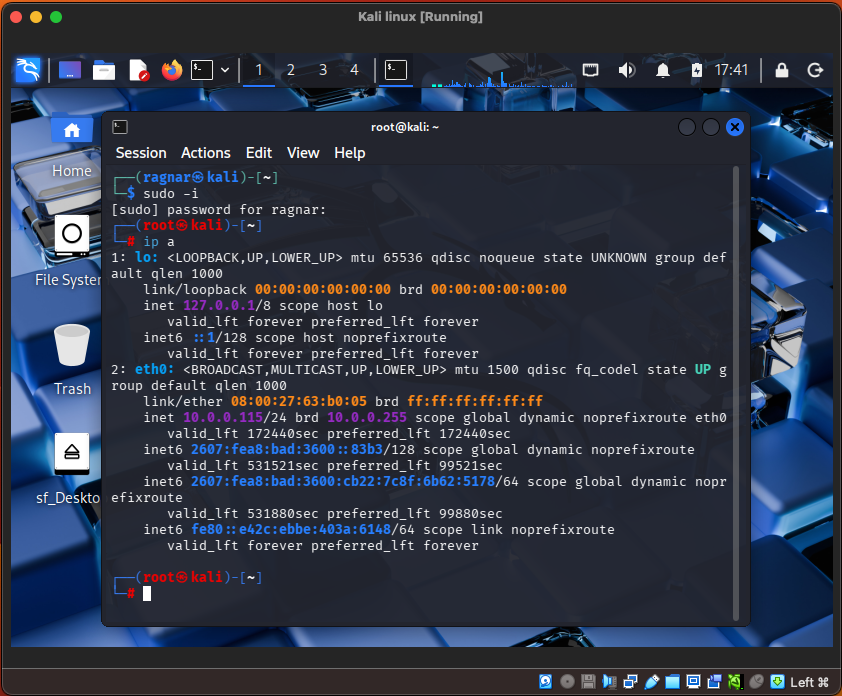
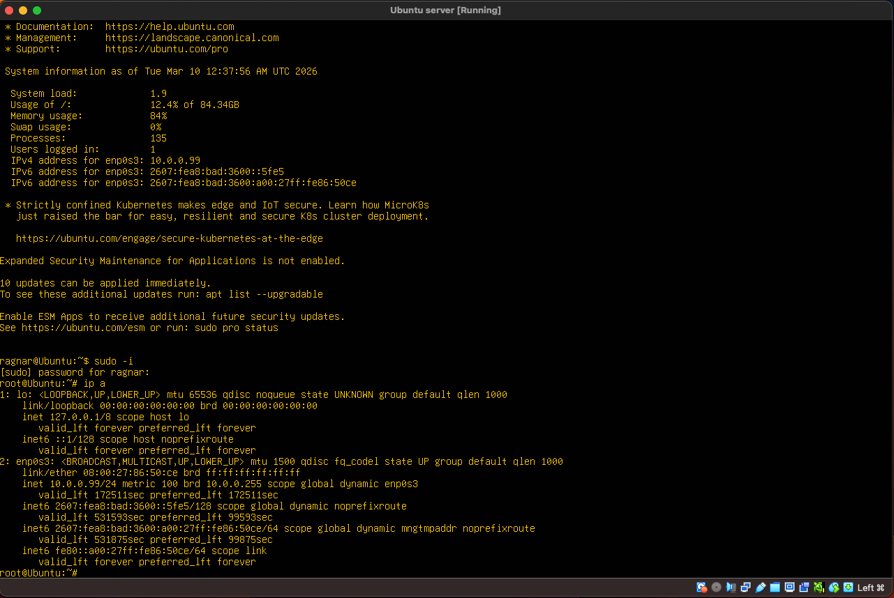
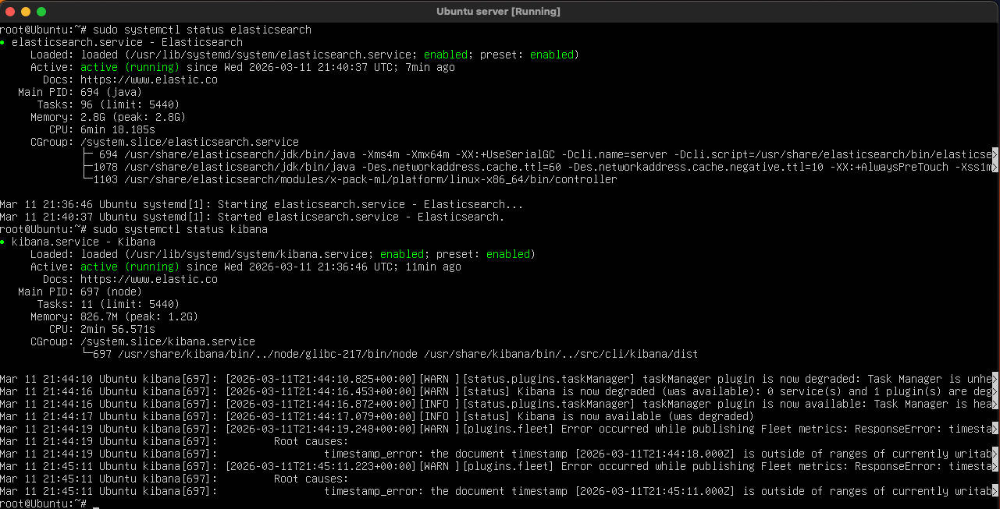
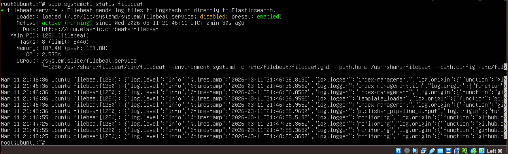


---------------------------------------------------------------------

🏗 LAB ARCHITECTURE

The environment consists of three primary systems.

| Component | Role |
|-----------|------|
| 🐉 Kali Linux | Attacker machine |
| 🐧 Ubuntu Server | Target host |
| 📊 Elastic Stack | SIEM platform |

--------------------------------------------------------------------

🗺️ ARCHITECTURE DIAGRAM

The attack telemetry flows through the Elastic monitoring pipeline.

            🐉 Kali Attacker
                   │
                   | SSH Brute Force / Intrusion
                   ▼
            🐧 Ubuntu Server
                   │
                   │ System logs (/var/log/auth.log)
                   ▼
             📦 Filebeat
                   │ Log forwarding
                   ▼
            🔎 Elasticsearch
                   │ Indexed security events
                   ▼
             📊 Kibana SIEM (Elastic Security)
                   │ Dashboards, alerts, investigation
                   ▼
            🕵 SOC Analyst

------------------------------------------------------------------

## ⚔️ ATTACK SCENARIO

The attacker targets the SSH service exposed on the Ubuntu server.

```
🔎 Reconnaissance
       │ System logs (/var/log/auth.log)
       ▼
🔑 SSH Brute Force
       │ 
       ▼
🔓 Successful Login
       │                         
       ▼    
⚡ Privilege Escalation
       │                         
       ▼    
🗝️ Credential Dumping
       │                         
       ▼    
🧬 Persistence Creation
       │                         
       ▼    
🔁 Backdoor Login (Re-entry)
       │                         
       ▼    
🚨 SOC Detection
       │                         
       ▼    
🕵️ Incident Investigation
       │                         
       ▼    
🛠️ Incident Response (Remediation)
```

------------------------------------------------------------------

## 🧰 TOOLS DEPLOYED

| Tool | Purpose |
|-----|------|
| 🐉 Kali Linux | Attack platform |
| 🧨 Hydra | SSH brute force |
| 🔐 SSH | Remote login |
| 📦 Filebeat | Log collection |
| 🔎 Elasticsearch | Log storage |
| 📊 Kibana | Visualization |
| 🛡️ Elastic Security | Threat detection |

-----------------------------------------------------------------

📂 LOG SOURCES MONITORED
```
/var/log/auth.log
        │
        ▼
SSH authentication events
        │
        ▼
Privilege escalation logs
        │
        ▼
User account changes
        │
        ▼
Credential access attempts
```
-----------------------------------------------------------------

🚨 ATTACK EXECUTION

🔎 1. Reconnaissance

The attacker begins by scanning the target system.
```
nmap -sV "Target IP"
```
Workflow
```
🐉 Kali Attacker
      │
      ▼
🔎 Port Scan
      │
      ▼
SSH Service Detected
```
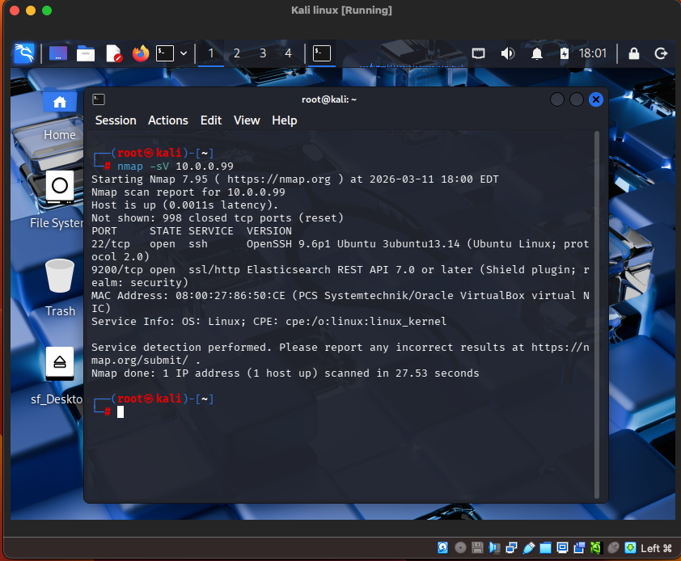

🔑 2. SSH Brute Force

The attacker attempts to guess passwords.
```
hydra -L users.txt -P rockyou-extract.txt ssh://"Target IP"
```
Workflow
```
💣 Hydra Attack
      │
      ▼
Multiple Failed Logins
      │
      ▼
📄 auth.log Entries
      │
      ▼
🚨 SIEM Detection
```
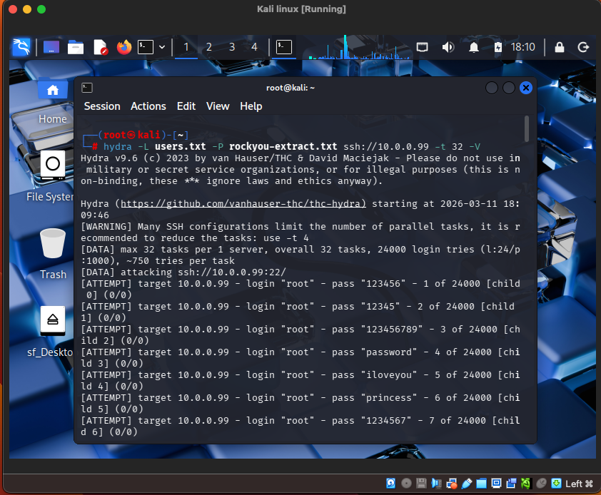
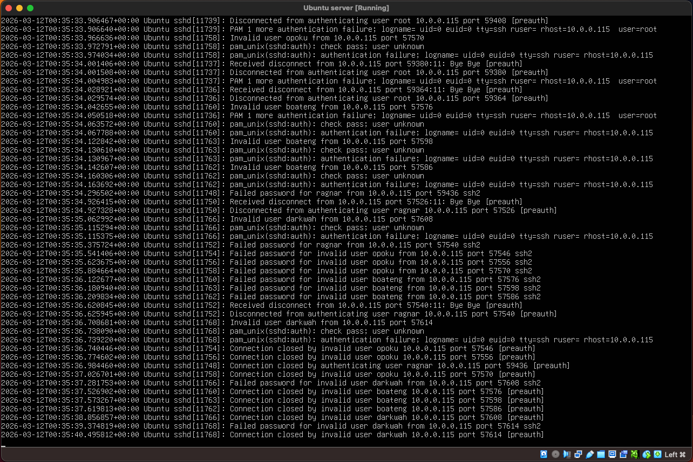

🔓 3. Successful Login

Eventually a password is discovered.
```
ssh "username"@"Target IP"
```
Workflow
```
Failed Logins
      │
      ▼
Correct Password Found
      │
      ▼
Successful Authentication
      │
      ▼
Unauthorized Access
```
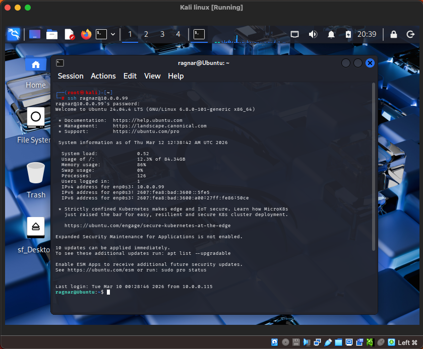

⚡ 4. Privilege Escalation

The attacker escalates privileges.
```
sudo -i
```
Workflow
```
  User Shell
      │
      ▼
⚡ sudo command
      │
      ▼
👑 Root Access
```

Indicator in logs:
```
sudo session opened
```
This indicates the attacker now has full administrative control.

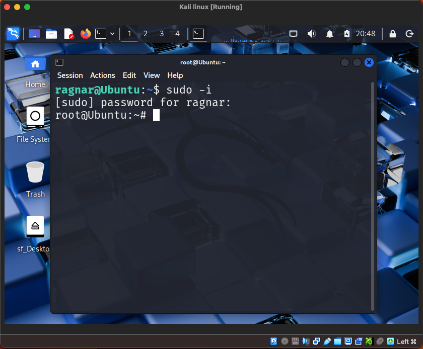


🗝️ 5. Credential Dumping

The attacker accesses the password hash database.
```
cat /etc/shadow
```

Workflow
```
👑 Root Access
      │
      ▼
Sensitive File Access
      │
      ▼
Password Hash Extraction
```

MITRE ATTACK
```
T1003 Credential Dumping
```
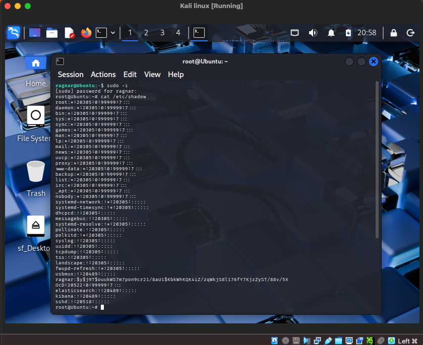


🧬 6. Persistence Creation

The attacker creates a backdoor user.
```
useradd backdoor
passwd backdoor
```

Workflow
```
Root Access
      │
      ▼
New User Created
      │
      ▼
Backdoor Account
      │
      ▼
Persistent Access
```
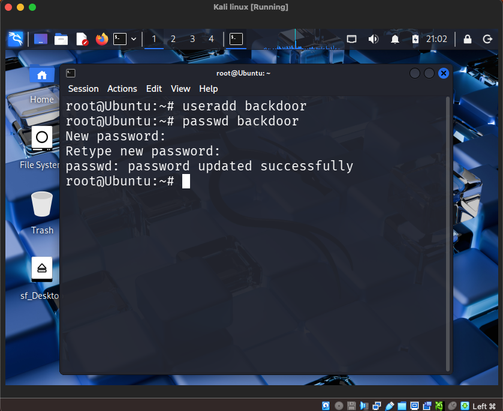


🔁 7. Backdoor Re-entry

The attacker reconnects later.
```
ssh backdoor@"Target IP"
```

Workflow
```
Backdoor Credentials
      │
      ▼
SSH Authentication
      │
      ▼
Persistent Access
```
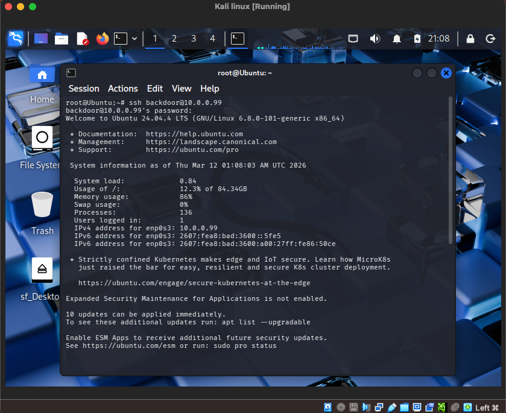

-------------------------------------------------------------------

🛡 DETECTION ENGINEERING

The SOC configured detections for multiple attack behaviours.

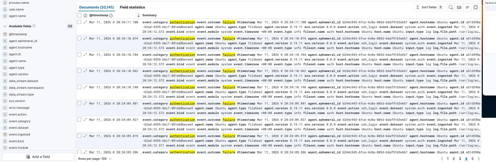


🚨 A. SSH Brute Force Detection

Indicator:
```
event.outcome: "failure"
```

Vector:
```
Multiple Failures
      │
      ▼
Threshold Triggered
      │
      ▼
🚨 Alert Generated
```

🔓 B. Successful Login Detection

Indicator:
```
event.outcome: "success"
```

Vector:
```
Successful Login
      │
      ▼
User Activity Investigation
```

⚡ C. Privilege Escalation Detection

Indicator:
```
sudo usage
```

Vector:
```
User Command
      │
      ▼
⚡ sudo invocation
      │
      ▼
Root Privileges
```

🧬 D. Suspicious User Creation

Indicator:
```
useradd
```

Vector:
```
New User Created
      │
      ▼
Potential Persistence
```

🗝  E. Credential Access Detection

Indicator:
```
/etc/shadow
```

Vector:
```
Sensitive File
      │
      ▼
Credential Dump Attempt
```
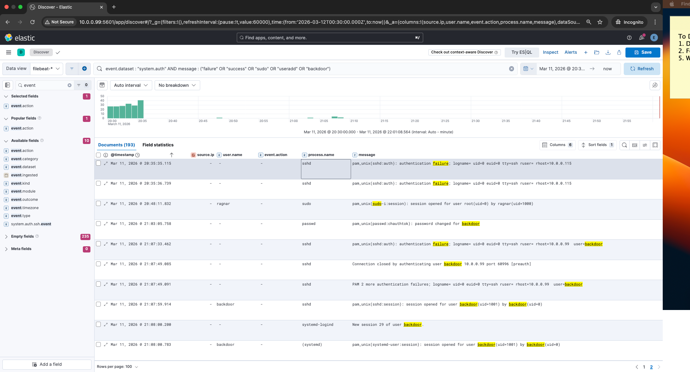

------------------------------------------------------------------

🕵️ SOC INVESTIGATION WORKFLOW
```
🚨 Alert Triggered
      │
      ▼
Review Failed Logins
      │
      ▼
Identify Successful Login
      │
      ▼
Investigate Privilege Escalation
      │
      ▼
Detect Credential Dumping
      │
      ▼
Identify Persistence
      │
      ▼
Contain Attacker
```
----------------------------------------------------------------

⏱ INCIDENT TIMELINE(EXCERPTS)

| Time | Event | Interpretation |
|-----|------|------|
| 20:35 | SSH authentication failures | Brute-force attempts begin |
| 20:46 | sudo escalation | Privilege escalation |
| 21:03 | backdoor account | Persistence established |
| 21:07 | login attempts with backdoor | Persistence tested |
| 21:08 | systemd session confirmed | Backdoor access confirmed |
                                                                                                                                               

                                                                                    
-----------------------------------------------------------------

🚑 INCIDENT RESPONSE

Terminate attacker session:
```
pkill -u backdoor
```
Remove persistence:
```
userdel -r backdoor
```
Delete home directory:
```
rm -rf /home/backdoor
```
Verify removal:
```
cat /etc/passwd | grep backdoor
```
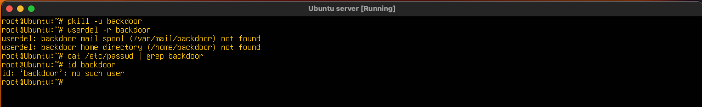

-----------------------------------------------------------------

🔒 HARDENING MEASURES
```
Security Controls
      │
      ├── 🔐 SSH Hardening
      ├── 🛑 Fail2ban
      ├── 🧱 Firewall
      ├── 🔑 Password Policy
      └── 📊 Continuous Monitoring
```
Recommended improvements:
- Disable password SSH authentication
- Enable SSH key authentication
- Install Fail2ban
- Enable firewall
- Disable root login

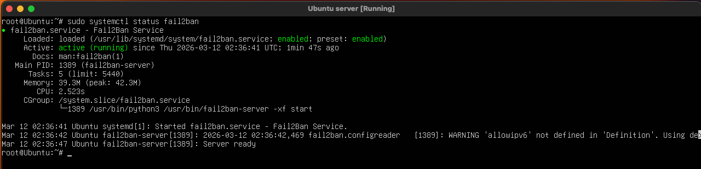
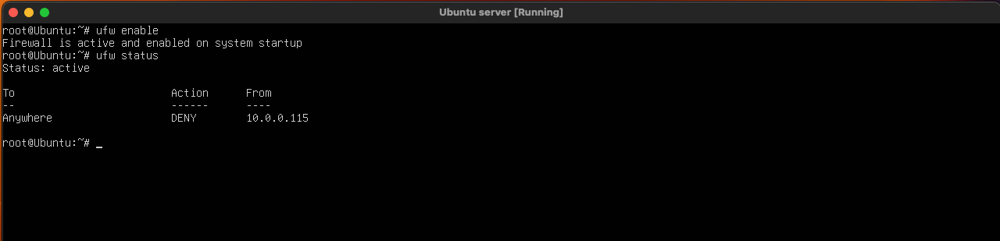
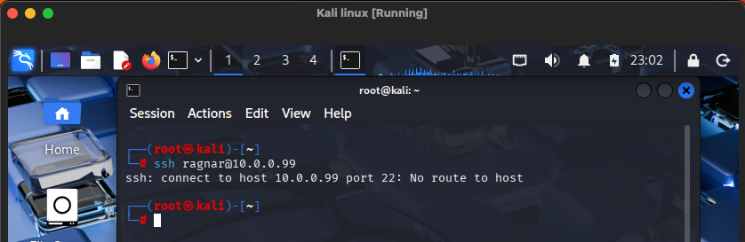

------------------------------------------------------------------

🎯 MITRE ATT&CK Mapping

| Tactic | Technique |
|------|------|
| Discovery | Network Service Discovery |
| Credential Access | Brute Force |
| Initial Access | Valid Accounts |
| Privilege Escalation | sudo abuse |
| Credential Access | Credential Dumping |
| Persistence | Create Account |
| Persistence | Account Manipulation |

-------------------------------------------------------------------

🧠 Skills Demonstrated

This project demonstrates practical SOC analyst skills including:
- SIEM engineering
- Linux log analysis
- threat detection
- incident investigation
- incident response
- MITRE ATT&CK mapping

Skills gained:

- Elastic SIEM configuration
- Linux log analysis
- SSH brute force detection
- Persistence investigation
- Incident response procedures
- Threat mapping using MITRE ATT&CK

------------------------------------------------------------------

📚 LESSONS LEARNED

Key insights from the lab:

- SSH brute-force attacks are easily visible with centralized logging
- Credential dumping creates strong detection signals
- Persistence through user accounts is detectable
- SIEM dashboards greatly accelerate investigations

-----------------------------------------------------------------

🏁 CONCLUSION

This project demonstrates a complete SOC detection and response workflow 
using Elastic SIEM.

It highlights the importance of:

- centralized logging
- detection engineering
- investigation workflows
- incident response
