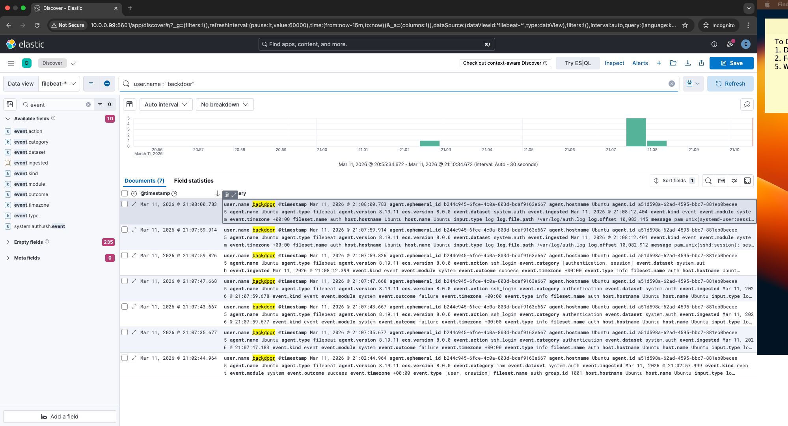

```
# Attacker Re-Entry

After establishing persistence, the attacker reconnects to the compromised system using the newly created backdoor account.

This demonstrates that the attacker can regain access even after the initial session ends.

## Command
```
ssh backdoor@"Target IP"
```

The attacker enters the password set earlier and obtains a shell on the system.

## Evidence



## Security Significance

This confirms that the persistence mechanism is functional.

The attacker now has a secondary access path to the system.

## Detection Opportunity

SOC analysts should investigate:

- new user accounts appearing in /etc/passwd
- successful SSH logins from unusual accounts
- authentication activity associated with the backdoor user

These events provide strong indicators of persistence activity during an intrusion.
```
