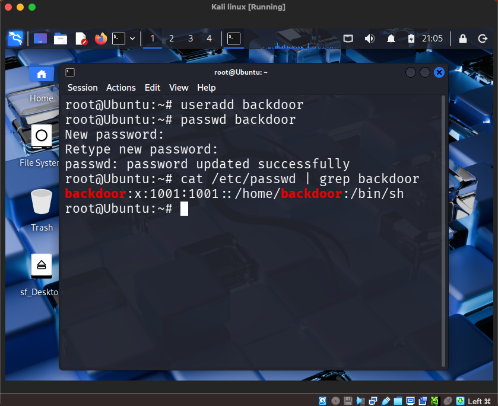

```
# Persistence via Backdoor Account

To maintain long-term access to the compromised system, the attacker creates a new user account.

This account acts as a persistence mechanism that allows the attacker to reconnect later even if the original compromised account is removed.

## Commands

Create the backdoor account:
```
useradd backdoor
```

Set a password:
```
passwd backdoor
```

## Verification

The attacker confirms the account exists:
```
cat /etc/passwd | grep backdoor
```

## Evidence



This confirms that the persistence account was successfully created.

## Security Impact

Creating unauthorized accounts is a common attacker persistence technique.

The attacker can later use this account to regain access to the system.
```
