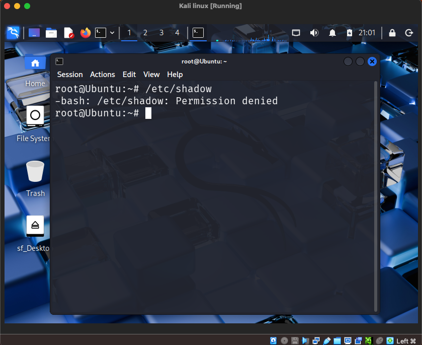

## Overview

Credential dumping is a common attacker technique used to extract password hashes from a system.

In Linux systems, credential hashes are stored in the /etc/shadow file.

Access to this file is highly sensitive and should be monitored.

## Target File
```
/etc/shadow
```
Only privileged users can access this file.

## Suspicious Command



## Security Impact

Accessing /etc/shadow allows attackers to:

- extract password hashes
- perform offline password cracking
- compromise additional accounts

## Detection Pattern

Suspicious sequence:

Successful login
↓
Privilege escalation
↓
Access to /etc/shadow

## SOC Response

If this activity is detected, the SOC team should immediately investigate the user account and determine whether the system has been compromised.

