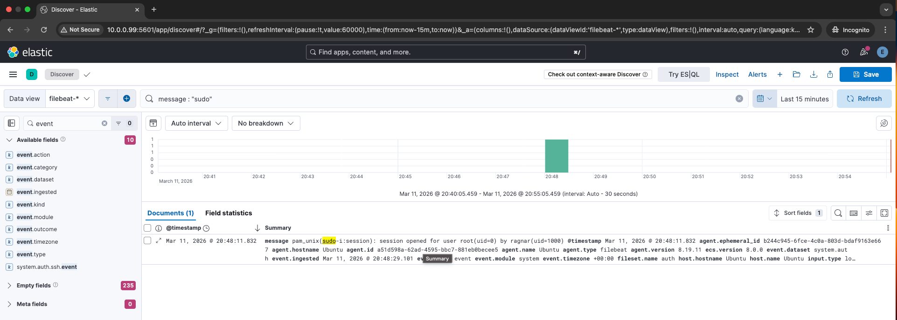

## Overview

Privilege escalation occurs when a user obtains higher-level access on a system.

In Linux environments, this often occurs through the sudo command.

## Data Source

Linux authentication logs:
```
/var/log/auth.log
```

## Detection Indicator


This indicates that the user ragnar obtained root privileges.

## Detection Logic

Relevant indicator:
```
sudo command execution
```

Detection Pattern:
User login
↓
sudo command
↓
Root session opened

## SOC Investigation

The SOC analyst should determine:

- whether the user normally has sudo privileges
- what commands were executed after escalation
- whether the escalation was expected or suspicious

Privilege escalation after a brute-force login is a strong sign of compromise.

