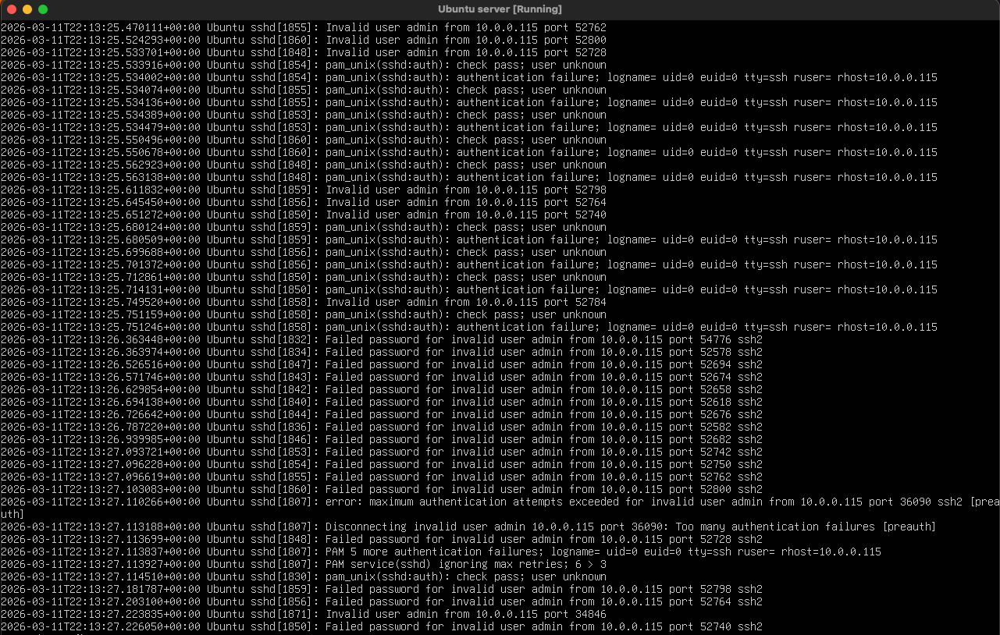
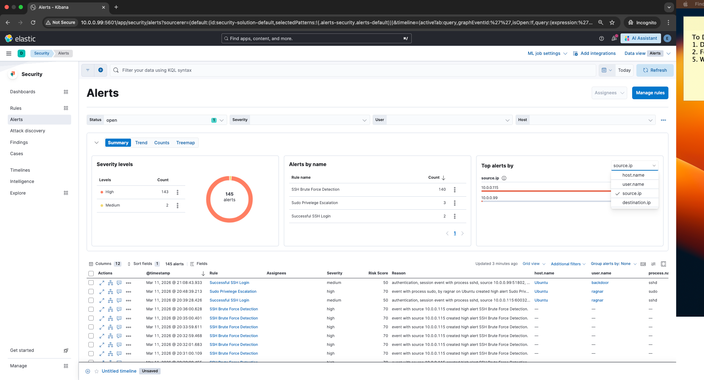

## Overview

The SOC investigation begins when Elastic SIEM generates alerts indicating suspicious authentication activity on the Ubuntu server.

These alerts are triggered due to a high number of failed SSH login attempts originating from the same source IP address.

## Initial Alert Indicators

Indicators observed:

- multiple authentication failures
- repeated login attempts
- activity originating from a single external host

These behaviors are commonly associated with SSH brute-force attacks.

## Investigation Steps

The SOC analyst begins by reviewing authentication activity in Kibana.

Relevant log source:
```
/var/log/auth.log
```

The analyst searches for authentication failures associated with the Ubuntu server.

## Evidence



## Key Questions

The analyst attempts to answer the following:

- What IP address is generating the login attempts?
- Which usernames are being targeted?
- How many failed attempts occurred?
- Did any login eventually succeed?

## Outcome

The alert triage confirms that a brute-force attack is occurring against the SSH service on the Ubuntu host.

