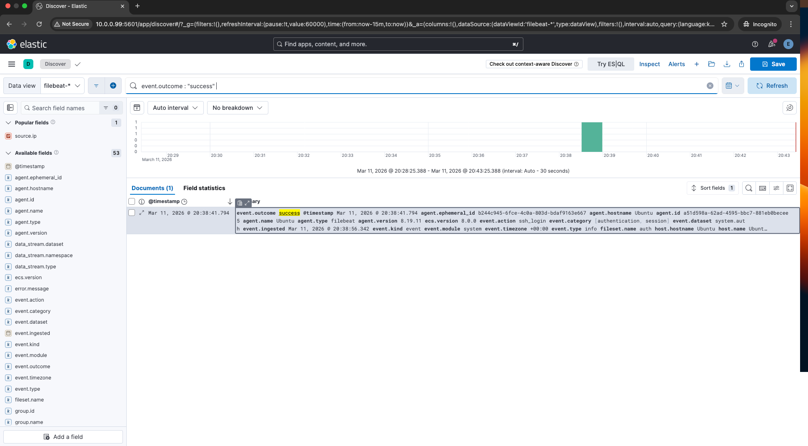

## Overview
This document analyzes the attacker’s behaviour observed during the SSH brute-force attack and post-compromise activity within the SOC lab environment.

The attacker targeted an exposed SSH service on the Ubuntu server and attempted to gain unauthorized access using automated credential guessing.

## Attack Stages Observed

### 1. Reconnaissance
The attacker first scanned the target system to identify exposed services.

Tool used:
- Nmap

Command
```
nmap -sV 10.0.0.99
```

This scan revealed that the SSH service (port 22) was exposed.


### 2. Initial Access – SSH Brute Force
The attacker attempted multiple login attempts using Hydra.

Tool used:
- Hydra

Command
```
hydra -L user.txt -P rockyou-extract.txt ssh://10.0.0.99
```
Indicators observed:

- Multiple failed authentication attempts
- Rapid login attempts from the same IP address

These events were captured in:
```
/var/log/auth.log
```

### 3. Successful Login
Eventually, the attacker successfully authenticated using valid credentials.

Indicators observed:

- Successful SSH login
- New session created
- Privileged shell access

Evidence



### 4. Privilege Escalation
The attacker attempted to gain elevated privileges to access sensitive files.

Indicators observed:

- sudo usage
- root level command execution

---

### 5. Credential Dumping
The attacker attempted to access the following file:
```
/etc/shadow
```

This file stores password hashes and is highly sensitive.

Access to this file indicates potential credential extraction.


## Key Indicators of Compromise

| Indicator | Description |
|--------|--------|
| Multiple SSH failures | Brute force attempt |
| Successful SSH login | Account compromise |
| sudo command usage | Privilege escalation |
| Access to ```/etc/shadow``` | Credential dumping |


## MITRE ATT&CK Mapping

| Technique | ID |
|--------|--------|
| Brute Force | T1110 |
| Valid Accounts | T1078 |
| Privilege Escalation | TA0004 |
| Credential Dumping | T1003 |


## Conclusion

The attacker successfully gained access through SSH brute-force, escalated privileges, and attempted credential dumping.

This behaviour represents a typical Linux compromise scenario that SOC analysts must detect and respond to.
